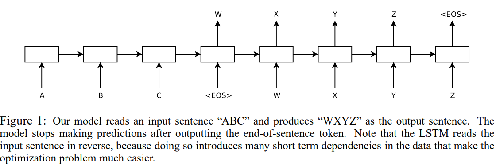

# Sequence-to-Sequence-Learning-Implementation

"Sequence to Sequence Learning with Neural Networks" by Ilya Sutskever, Oriol Vinyals and Quoc V. Le.

Paper: https://arxiv.org/pdf/1409.3215.pdf

## Architecture



## Usage

For training we can run following script.

```sh
python train.py
```

## Improvements to do

- Don't split data into train, valid and test sets when working with unprocessed default data. (Data won't be distributed correctly)
- Write a translation script.

## Citation

```bibtex
@misc{sutskever2014sequence,
      title={Sequence to Sequence Learning with Neural Networks}, 
      author={Ilya Sutskever and Oriol Vinyals and Quoc V. Le},
      year={2014},
      eprint={1409.3215},
      archivePrefix={arXiv},
      primaryClass={cs.CL}
}
```